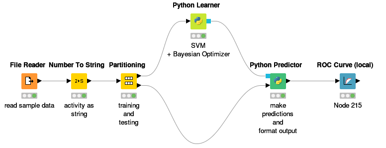
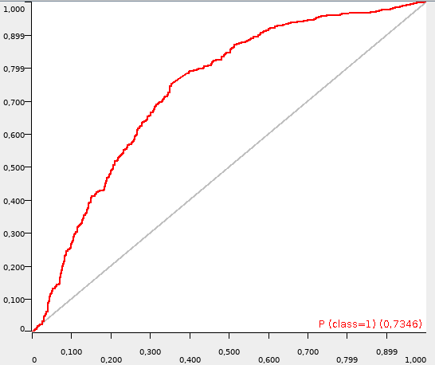

# bayesian-svm-knime-scikit

Bayesian Optimization of SVM parameters C and gamma, with scikit-learn, to be used in KNIME in Python learner node. Based on the [optimization functions by thuijskens](https://github.com/thuijskens/bayesian-optimization).

## Setup

- In python node please select python2.
- copy&paste the python code into the code window of Python Learner (`python-learner.py`) and Python Predictor (`python-predictor.py`)
- sample workflow:




- fine tuning - edit variables at the top of the `python-learner.py`:

```python
# values of log10 gamma and C
# from https://www.ncbi.nlm.nih.gov/pmc/articles/PMC4534515/
# - log10(C) in [ - 2, 5]
# - log10(gamma) in [ - 10, 3]

bounds = np.array([[-2, 5], [-10, 3]])

# number of optimizations for bayesian optimizer
n_iters = 50

# number of initial samples to calculate
n_pre_samples=10
```

- please note: scripts (after slight modifications) can be run from the command line
- sample data file provided (`nr-ahr-lite.csv ` from my [tox21 dataset](https://github.com/filipsPL/tox21_dataset))

## Sample output

- standard output from the Python Learner gives you C, gamma and CV AUROC values:

```
best C 82404.4422051
best gamma 1.01295459839e-10
best AUROC 0.793847566575
```

- output ROC (from the ROC Curve node):


